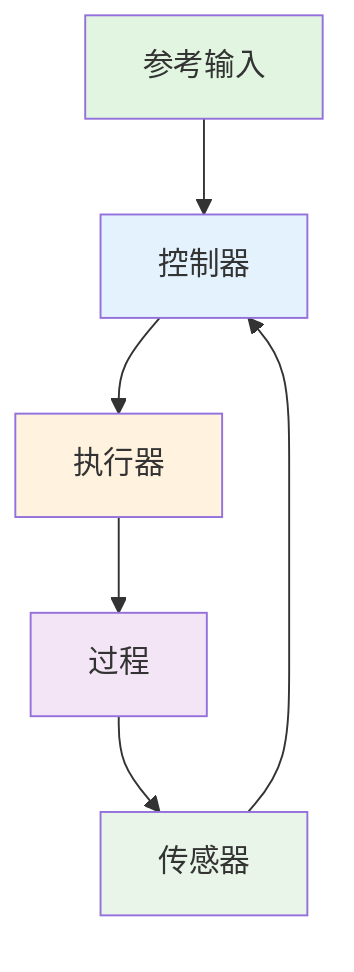

# 轮腿入门学习任务

首先在你的文件夹下*（带你名字简写的那个）*，建立一个新文件夹，路径如下：`task/balance`

然后在***该文件夹***下创建一个文件，名为`balance_learn.md`，可以在这个文件下填写你实现的功能描述及截图。***截图统一放到 `task/pic`，采用相对路径引用。***

将下面这个表格复制进你创建的文件下。

任务要求的功能和自己实现的功能填到下面表格，记得总结你觉得的重点！

| 功能             | 完成情况 | 说明 |
| ---------------- | -------- | ---- |
| 平衡小车URDF     |          |      |
| 平衡小车关节驱动 |          |      |
|                  |          |      |
| ...              | ...      | ...  |

遇到问题，可以在群里问。但在提问之前，想想这个问题有没有可能通过谷歌或者AI就能轻松解决？

## 一阶倒立摆  --平衡小车

运动需求：

- 小车能够自起（指小车从到在地上到平衡的状态）
- 小车能够平衡，且能够在一定距离内稳定，最好能在不发送运动命令的情况下，静止不动
- 小车能够前后移动
- 小车能够转向

给这个平衡小车项目额外创建一个工作空间，同样放在task/balance下，之后都在这个工作空间下写代码，命名为balance_car_ws

将该工作空间作为一个git仓库上传到自己Github上，同时作为子模块上传到本仓库，具体可以搜索`git submodule`

### 搭建平衡小车URDF

#### 要求

利用URDF自带的长方体、圆柱体等标签，编写平衡小车URDF，能在`gazebo`中加载

在没有加载控制器的情况下，小车需要是**跌倒**的状态

各link的质量和惯性矩阵需要符合现实

#### 一些建议

对于轮关节的参考最大力矩，可以看队内车的URDF参数。

底盘重心尽可能低，否则你可能比较难实现小车子自起。

### 平衡小车关节驱动

使小车轮子转起来，只要能在Gazebo中，让轮子转动起来即可。

#### 一些建议

或许可以试着在仿真把小车架起来，测试旋转效果？

### 为平衡小车添加IMU

给平衡小车添加底盘IMU，为后续控制器建立闭环做准备

#### 一些建议

可以用官方的IMU，也可以使用队内的IMU

### 搭建平衡小车控制器

首先阅读下，该参考文章 

[一阶倒立摆的PID控制和LQR控制](https://zhuanlan.zhihu.com/p/54071212)

通过这篇文章，理解对于该平衡小车，

为了使小车实现平衡和其他的运动需求，我们需要控制哪些*状态*？

注意，这里不是要看懂全部理论知识，重点在于控制器的搭建，控制环路的设计，如何实现控制闭环？

**工程和理论往往不能划等号**

#### 使用PID控制

通过搭建PID控制器，实现小车的运动需求

#### 使用LQR控制

通过搭建LQR控制器+PID控制器，实现小车的运动需求

### （选做）给小车底盘添加云台

试着给小车底盘添加个云台

#### 一些建议

云台不要过重，质心尽可能居中。
